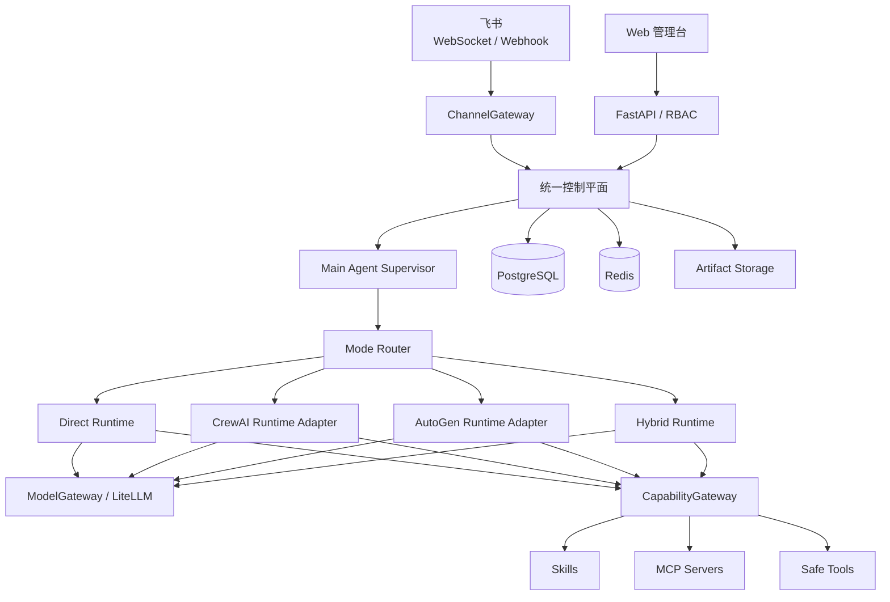

# Agent Hub 多智能体平台设计

- 状态：待用户最终审阅
- 日期：2026-08-05
- 部署目标：Linux 云服务器
- 首发渠道：飞书

## 1. 目标

构建一个由主 Agent 统一管理的多智能体平台，同时满足以下需求：

1. 同一个模型或同一个 API 可以被多个角色复用，每个角色拥有独立提示词、工具、Skill、记忆和权限。
2. 一个任务可以同时使用多个厂商、多个中转站或多个模型。
3. 支持 CrewAI 风格的派单执行、AutoGen 风格的群聊讨论，以及二者组合的混合执行。
4. 主 Agent 负责识别意图、选择执行模式、控制预算、调度执行、处理审批、汇总结果和维护任务状态。
5. 支持多模态视觉模型，能够接收和理解飞书或 Web 上传的图片。
6. 用户可以通过飞书私聊、群聊中 `@机器人` 或 Web 管理台交互和管理系统。
7. 支持 YAML 配置、Skill、MCP、长期记忆、知识库、定时任务、审计和任务恢复。
8. 同时提供 Docker Compose 和不依赖 Docker 的原生 Linux 部署。
9. 提供统一的一键安装脚本，安装完成并通过健康检查后可立即进入 Web 管理台初始化管理员。

## 2. 首版范围与非目标

首版包含飞书 WebSocket 长连接和 HTTPS Webhook，两者可配置切换；不包含个人微信、企业微信或微信公众号。首版管理台支持飞书 OAuth 与本地账号两种登录方式。

系统借鉴 OpenClaw 的统一控制平面、会话隔离、执行运行时注册和原子配置快照，借鉴 CowAgent 的 Agent Core、分层记忆、知识库、上下文压缩和定时任务，但不直接依赖或复制这两个项目的运行时。

首版不会让主 Agent 默认访问宿主 Shell，不允许上传的 Skill 自动获得权限，也不允许 Agent 未经批准自行修改并发布提示词、工作流或 Skill。

## 3. 技术架构

建议技术栈：Python 3.12、FastAPI、SQLAlchemy、Alembic、Celery、PostgreSQL、Redis、LiteLLM Proxy、CrewAI、AutoGen AgentChat，以及 React + TypeScript 管理台。依赖使用锁文件和固定版本，升级前运行适配器契约测试。

### 3.1 进程边界

- `api`：管理 API、Web 静态资源、飞书 Webhook、OAuth 和健康检查。
- `feishu-connector`：飞书长连接、消息标准化、幂等去重和回复投递。
- `worker`：执行主 Agent、CrewAI、AutoGen、定时任务和后台作业。
- `litellm`：统一模型协议、路由、限流、重试、降级和用量采集。
- `skill-runner`：隔离执行经过批准的 Skill 脚本；原生部署时由 systemd 临时沙箱替代。

这些进程使用同一代码包，但可独立扩缩容。飞书接入只负责快速校验和入队，不在回调或长连接处理线程中运行耗时 Agent。

## 4. 主 Agent 执行引擎

产品和文档使用“执行引擎”一词，代码使用 `ExecutionRuntime` 与 `RuntimeAdapter`，不引入其他近义术语。

一次主 Agent 运行包含以下阶段：

1. `Ingress`：标准化渠道消息，确定租户、用户、会话和幂等键。
2. `ContextBuilder`：装载当前会话、相关记忆、知识、允许使用的 Skill/MCP、预算和权限。
3. `SupervisorLoop`：理解任务、选择模式、执行或观察、必要时重规划。
4. `ExecutionRuntime`：运行 Direct、CrewAI、AutoGen 或 Hybrid 执行引擎。
5. `ResponseComposer`：生成适配飞书或 Web 的最终答复、引用、警告和执行摘要。
6. `LearningHooks`：生成记忆候选和系统改进草稿，不自动发布配置变更。

每个 Agent 拥有独立的逻辑工作区、会话、模型绑定、Skill 集和权限策略。配置发布会生成不可变的 `RuntimeGeneration`。新任务原子切换到新版本，已经运行的任务继续使用启动时版本，避免热更新造成上下文混用。

## 5. 模式识别与纠偏

系统不能依赖一次 LLM 分类。模式选择按以下优先级执行：

1. 用户明确输入 `/direct`、`/dispatch`、`/discuss` 或 `/hybrid` 时，严格使用指定模式。
2. 确定性规则识别简单问答、固定工作流、明确讨论请求、高风险操作和必须审批的任务。
3. 路由模型输出结构化结果：推荐模式、理由、置信度、预计角色、预计时间、费用和风险。
4. 复杂、昂贵或边界任务由独立轻量校验器复核；分类结果不一致时视为低置信度。
5. 自动执行前校验角色、依赖、工具权限、预算和终止条件。

默认自动执行阈值为 `0.85`，可由管理员调整。低于阈值、两个分类器意见不一致，或预计费用/风险超过策略阈值时，系统优先发送飞书交互卡片，请用户选择模式。卡片不可用时改为文本询问。未得到答复前任务进入 `WAITING_USER_MODE`，复杂或高成本任务不会自行执行。

执行过程中允许无损纠偏：Direct 可升级为 Dispatch；Dispatch 可升级为 Hybrid；Discuss 缺少事实材料时可先派单调查再恢复讨论。已经产生的结果保存为统一 Artifact，切换模式时不重复完成已确认步骤。

## 6. 四种执行模式

### 6.1 Direct

适用于简单问答或单一工具调用。单个 Agent 在预算和工具策略内完成任务，不创建子 Agent。

### 6.2 Dispatch

由 CrewAI 适配器执行。主 Agent 可以选择 YAML 固定工作流，或生成经过类型约束的任务 DAG。系统在运行前检查未知角色、依赖环、工具权限、时间和费用预算。

无依赖步骤可并行执行。每一步输出结构化 Artifact。Reviewer 检查完整性和证据，失败步骤按配置重试、切换备用模型或返工；Synthesizer 最后汇总结果。

### 6.3 Discuss

由 AutoGen `SelectorGroupChat` 执行。参与角色来自已发布 YAML，或由主 Agent 从角色白名单中选择 2–8 个。群聊共享任务上下文，由选择器决定下一位发言者。

任一条件满足即结束：达成可验证共识、输出明确完成标记、达到最大轮数、时间、token 或费用上限、用户取消。结束后由独立 Synthesizer 输出共识、分歧、证据和最终建议。

系统仅保存 Agent 明确消息、引用、工具事件和决策摘要，不请求或展示模型隐藏思维链。飞书默认只显示阶段进度和最终结论，用户可用 `/details` 查看允许公开的讨论记录。

### 6.4 Hybrid

先使用 Dispatch 并行获取材料，再把结构化 Artifact 提交给 Discuss 审议，最后由主 Agent 汇总。两个框架不直接共享内部对象，只交换统一协议对象。

## 7. 统一运行协议与状态机

核心领域对象包括：

- `TaskRequest`：用户目标、渠道、会话、显式模式和附件。
- `RunPlan`：模式、角色、步骤、依赖、预算、工具和终止规则。
- `Artifact`：类型、内容引用、来源、生产者、版本和完整性哈希。
- `RunEvent`：阶段、显式消息、工具调用、审批、费用和错误事件。
- `RuntimeCheckpoint`：可恢复的 CrewAI/AutoGen 状态和统一步骤边界。

统一状态机为：

`QUEUED → PLANNING → WAITING_USER_MODE/RUNNING ↔ WAITING_APPROVAL → SYNTHESIZING → COMPLETED`

异常分支包括 `RETRYING`、`PAUSED`、`FAILED` 和 `CANCELLED`。Worker 崩溃后从最近的安全检查点恢复；不确定是否已经成功的外部写操作不得自动重放。

## 8. 模型网关

LiteLLM Proxy 作为独立 `ModelGateway`。Agent 仅绑定逻辑模型名，例如 `fast`、`reasoning`、`reviewer`，不感知 API Key。

一个逻辑模型可以配置多个 Deployment：官方厂商、OpenAI-compatible 中转站、本地模型或备用供应商。同一中转站可以注册多个模型，同一模型也可供多个角色复用。路由支持权重、限流、超时、重试、熔断和降级。

API Key 不允许通过飞书提交或回显。Web 管理台可通过 HTTPS 写入动态密钥；密钥使用环境中的主密钥进行信封加密。也可只使用环境变量或外部 Secret Manager。日志、异常、审计详情和 YAML 导出均不得包含明文密钥。

### 8.1 多模态视觉模型

模型 Deployment 必须声明能力元数据，包括 `text`、`vision`、`tool_calling`、`structured_output`、上下文上限和允许的媒体格式。Agent 绑定逻辑模型时可以声明 `requires: [vision]`，ModelGateway 只能从满足能力要求的 Deployment 中选择，避免把图片发送给纯文本模型。

飞书或 Web 收到图片后执行以下流程：

1. 使用渠道授权下载附件，并校验文件签名、MIME、大小、像素上限和格式。
2. 清除不需要的 EXIF 信息，将文件保存为有租户权限和过期策略的受控 Artifact。
3. 主 Agent 判断任务是否需要 OCR、通用视觉理解或特定视觉 Skill，并选择对应视觉角色和逻辑模型。
4. 视觉角色输出结构化 `ImageAnalysisArtifact`，包含描述、识别文本、对象/区域、置信度、模型和来源图片哈希。
5. 后续 CrewAI 或 AutoGen 角色优先共享结构化分析结果，只有获得图片权限且确有需要的视觉模型才读取原图，以降低费用和隐私暴露。

首版支持 JPEG、PNG 和 WebP，可配置单图、单次消息总大小、图片数量和保存期限。文字型图片可配置本地 OCR 作为降级；OCR 不能替代通用视觉理解。识别置信度不足、视觉模型不可用或图片不合规时，系统明确询问用户或报告限制，不编造识别结果。

每个模型 Deployment 可配置数据出境和敏感图片策略。含敏感标记的 Artifact 只能发送到获准的模型供应商，并记录提供方、用途和操作者审计。首版范围仅要求图片理解，不包含图片生成或编辑。

## 9. 配置系统

YAML 是可读、可审查、可导入导出的配置格式。PostgreSQL 中的已发布配置版本是生产运行真源，避免多实例直接改共享文件。

配置流程为：导入或编辑 → 草稿 → Schema 校验 → 权限校验 → 连接/工作流测试 → 查看 Diff → 发布 → 原子热加载。每次发布记录操作者、来源、时间、Diff 和回滚点。

飞书管理员可查看和修改角色提示词、模型绑定、工作流、参数及启停状态。修改使用结构化命令或交互卡片，不接收任意 YAML 文本覆盖。Web 管理台提供完整表单、YAML 导入导出、测试、发布和回滚。

## 10. 飞书与 Web 管理

飞书支持机器人私聊和群聊中 `@机器人`。接入方式可选择 WebSocket、Webhook 或两者同时启用；同一事件必须基于 `event_id`/`message_id` 去重。

主要飞书命令包括：

- `/auto`、`/direct`、`/dispatch`、`/discuss`、`/hybrid`
- `/status`、`/details`、`/pause`、`/resume`、`/cancel`
- `/config show|set|diff|publish|rollback`
- `/skill list|upload|approve|enable|disable`
- `/mcp list|enable|disable`

Web 支持飞书 OAuth 和本地账号。第一个超级管理员由环境变量中的飞书 `open_id` 白名单引导创建，之后可在 Web 中管理。角色分为 `super_admin`、`admin`、`operator` 和 `viewer`。本地密码使用强密码哈希，认证方式可分别关闭。

## 11. Skill、MCP 与工具权限

`CapabilityGateway` 是所有能力调用的唯一入口，CrewAI 和 AutoGen 不得绕过该层直接执行工具。

权限按“用户/角色 + Agent + Skill/MCP + 操作 + 资源范围”判断：

- `SAFE`：搜索、计算、经过 SSRF 防护的只读 HTTP 获取、授权工作区内只读文件、只读知识库和只读状态查询，可自动执行。
- `RESTRICTED`：外发消息、写数据、启用 Skill 和敏感资源访问，需要策略规定的单次或会话审批。
- `DENIED`：宿主 Shell、Docker socket、越权文件访问和提权操作，始终禁止。

Skill 来源包括本地目录、Git/URL、Skill 市场和飞书上传。上传包先进入隔离区，完成大小、类型、路径穿越、Manifest、依赖和静态风险检查，再由管理员查看 Diff 并批准。批准版本记录内容哈希和依赖锁定信息。

Docker 模式使用非 root、只读根文件系统、默认断网、无宿主目录和无 Docker socket 的 `skill-runner`。原生模式使用 systemd 临时服务，启用 `DynamicUser`、`NoNewPrivileges`、`ProtectSystem=strict`、私有临时目录、网络限制、CPU/内存和运行时上限。

MCP 支持 stdio、SSE 和 Streamable HTTP。服务器地址、认证、域名和具体工具必须进入白名单，支持健康检查、热加载和逐调用审计。

## 12. 记忆、知识库与定时任务

记忆分为：

- Working Memory：当前任务上下文、显式消息和检查点，按会话生命周期过期。
- Episodic Memory：每日或每次任务的事实性摘要，可查看、修改和删除。
- Core Memory：稳定的用户偏好和长期事实，只从经过筛选的候选中生成。

知识库与记忆分离，保存文档、事实、来源和版本，使用关键词与向量混合检索。所有记忆按租户和用户隔离，写入前过滤提示注入、密钥和敏感字段，并支持“忘记”操作。

定时任务支持一次性提醒、周期工作流和未完成任务跟进。Agent 可以提出 Prompt、工作流或 Skill 改进草稿，但必须经过测试和管理员批准才能发布，禁止静默自我改写。

## 13. 数据模型

PostgreSQL 保存用户、认证、RBAC、Agent、逻辑模型、Deployment、工作流及版本、会话、Run、Step、显式消息、Artifact 元数据、检查点、审批、Skill、MCP、定时任务、用量和审计记录。

Redis 保存任务队列、分布式锁、短期缓存、限流计数和临时流式事件。大文件保存到本地 Artifact 目录或 S3 兼容对象存储，数据库只保存元数据、哈希和引用。

## 14. 部署

### 14.1 Docker Compose

提供固定镜像版本的 Compose 文件，包含 Web/API、飞书连接器、Worker、LiteLLM、Skill Runner、PostgreSQL 和 Redis。数据库和 Redis 可通过环境配置替换为云服务。提供健康检查、命名卷、资源限制、备份和升级脚本。

### 14.2 原生 Linux

完全不要求安装 Docker，支持：

- Ubuntu 22.04/24.04 LTS
- Debian 12/13
- Rocky Linux 9 / AlmaLinux 9

安装器检测 `apt` 或 `dnf`，创建专用系统用户、Python 虚拟环境和 systemd 服务。应用安装到 `/opt/agent-hub`，环境配置放在 `/etc/agent-hub`，运行数据放在 `/var/lib/agent-hub`。API、飞书连接器、Worker 和 LiteLLM 分别运行在 systemd 单元中。

PostgreSQL、Redis 可安装在本机或使用外部 DSN。Nginx/Caddy 为 Web 和 Webhook 提供 HTTPS；只使用飞书长连接且管理台不对公网开放时，无需飞书公网回调入口。

两种部署遵循相同升级流程：备份 → 迁移预检 → 数据库迁移 → 分批重启 → 健康检查 → 失败回滚。

### 14.3 统一一键安装脚本

项目根目录提供单个 `install.sh`，用户使用 `sudo bash install.sh` 启动交互式安装，并选择 Docker Compose 或原生 systemd。脚本也提供 `--mode docker|native` 和配置文件参数，方便云主机镜像及自动化部署；交互模式与无人值守模式调用同一安装核心。

脚本按以下顺序执行：

1. 检测 CPU 架构、Linux 发行版、磁盘/内存、端口、DNS、现有 PostgreSQL/Redis 和安装权限。
2. 选择部署模式、本地或外部数据库、访问域名/IP、HTTPS 方式及安装目录。
3. 安装或验证依赖，使用固定版本和校验和，禁止未经校验执行二次下载脚本。
4. 生成主加密密钥、数据库密码和服务内部凭证。原生模式写入 root 所有且权限为 `0600` 的 `/etc/agent-hub/secrets.env`；Docker 模式使用同等权限的部署 Secret 文件。
5. 安装应用、运行数据库迁移、启动 API、飞书连接器、Worker、LiteLLM 和依赖服务。
6. 逐项执行健康检查和最小 smoke test；任一步失败时停止发布、保留诊断并恢复到安装前安全状态。
7. 输出 Web 管理台 URL 和单次使用、短时有效的初始化码。用户在 `/setup` 页面输入初始化码，创建本地超级管理员或绑定飞书 OAuth；成功后初始化入口立即关闭。

如果域名已经正确解析，安装向导可以配置 Caddy/Nginx 并申请受信任的 HTTPS 证书；如果只有服务器 IP，则明确显示本地/临时访问方案和安全提示。脚本可以配置主机防火墙，但不能修改云厂商安全组，因此必须输出需要用户放行的端口和最终访问地址。

脚本必须具备幂等性：重复运行时识别现有安装，提供修复、升级或退出选择，不覆盖数据库和密钥。所有敏感输入关闭终端回显，日志进行脱敏。项目同时提供 `doctor`、`backup`、`restore` 和 `upgrade` 命令，便于安装后的维护。

## 15. 错误处理与可观测性

- 模型超时、限流和临时错误使用指数退避；达到条件后切换备用 Deployment。
- 配置错误不会替换当前运行版本；失败草稿保留诊断信息。
- 外部写工具必须提供幂等键；未知结果进入人工确认。
- 审批超时、用户取消、预算耗尽和终止条件都形成明确终态并通知飞书。
- `run_id` 贯穿渠道、主 Agent、两个框架、模型和工具。
- 输出结构化日志、健康检查、队列深度、延迟、错误率、token 和费用指标。

## 16. 测试与验收

测试分为：

1. 单元测试：模式路由、双分类器分歧、状态机、配置 Schema、RBAC、预算和权限策略。
2. 契约测试：CrewAI、AutoGen 与 LiteLLM 升级后仍满足统一 Runtime 接口。
3. 集成测试：PostgreSQL、Redis、MCP、Skill Runner、配置发布和检查点恢复。
4. 端到端测试：模拟飞书长连接/Webhook、卡片失败转文本询问、任务取消、进程崩溃和恢复。
5. 安全测试：恶意 Skill 包、路径穿越、Prompt 注入、密钥泄露、越权配置和沙箱逃逸基线。
6. 部署测试：Docker Compose，以及 Ubuntu、Debian、Rocky/AlmaLinux 原生安装 smoke test。
7. 安装器测试：全新安装、重复运行、半途失败恢复、外部数据库、HTTPS、初始化码失效和日志脱敏。

MVP 验收必须证明：

- 同一 API/模型可供不同角色使用，角色上下文与权限互不混淆。
- 同一任务可使用多个模型和中转站，并在故障时按策略降级。
- 飞书和 Web 图片能够按模型能力正确路由；纯文本模型不会收到图片，识别结果带来源和置信度。
- Direct、Dispatch、Discuss、Hybrid 均可由命令指定并被自动路由。
- 低置信度时飞书卡片询问，失败时文本询问，未确认不启动复杂任务。
- 飞书私聊、群聊、Web 配置、Skill/MCP、审批、恢复和审计形成闭环。
- Docker 与三类原生 Linux 部署功能一致且可重复安装、升级和回滚。
- 单个 `install.sh` 可选择 Docker 或原生模式；成功后输出可访问的管理台地址，且一次性初始化流程可以创建首位管理员。

## 17. 参考项目

- OpenClaw：https://github.com/openclaw/openclaw
- OpenClaw Agent Runtime：https://docs.openclaw.ai/agent-runtime-architecture
- CowAgent：https://github.com/zhayujie/CowAgent
- CrewAI：https://docs.crewai.com/
- AutoGen AgentChat：https://microsoft.github.io/autogen/stable/user-guide/agentchat-user-guide/
- LiteLLM：https://docs.litellm.ai/docs/
- 飞书事件订阅：https://open.feishu.cn/document/server-docs/event-subscription-guide/overview
